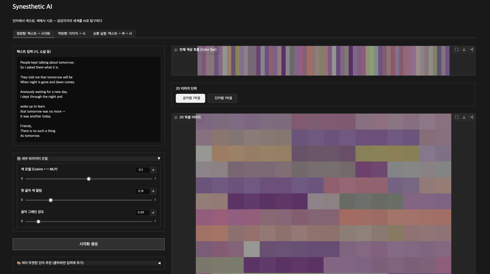
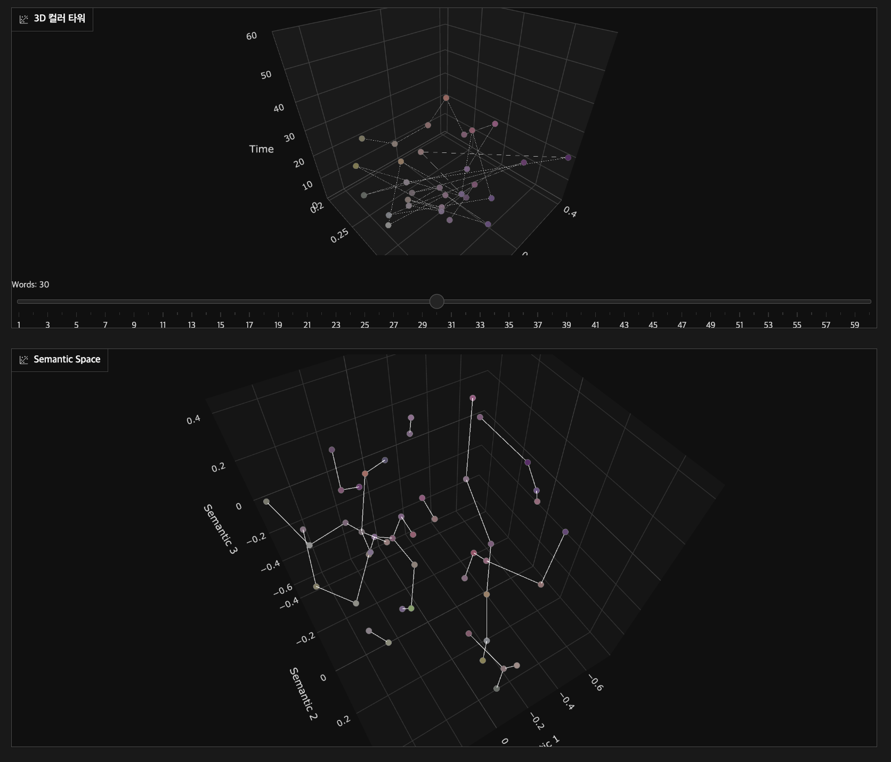
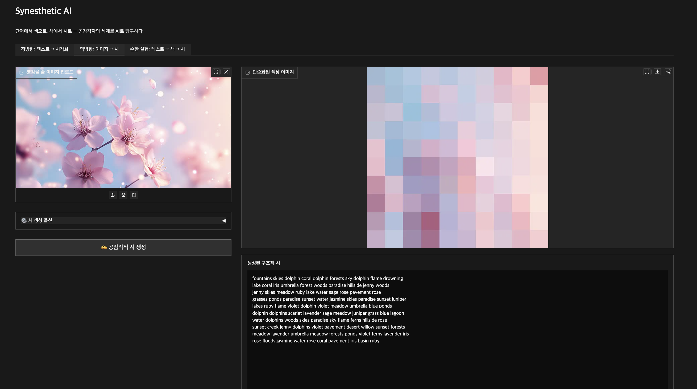
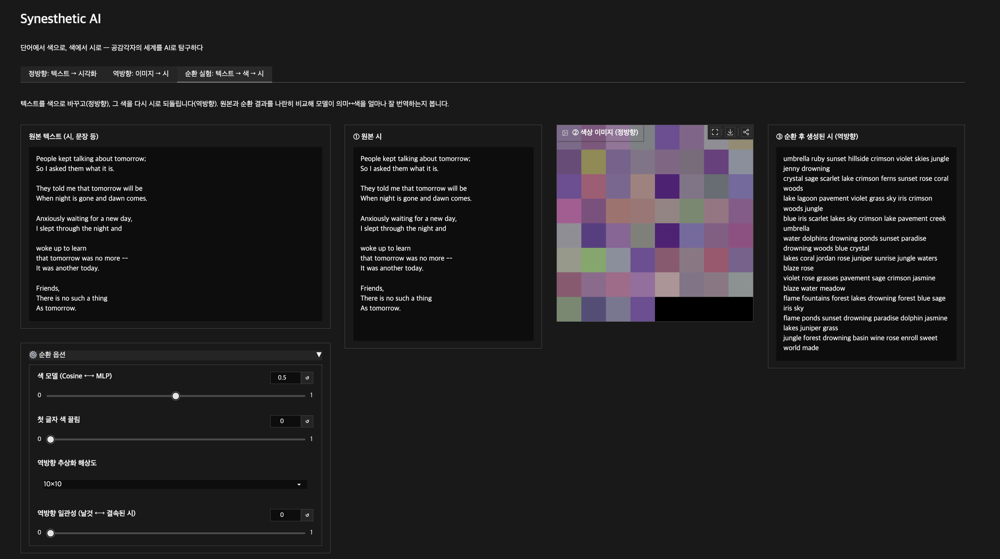

# Synesthetic AI

**단어 벡터를 통한 문자-색 공감각의 시각화**
Visualization of Grapheme-Color Synesthesia through Word Vectors

> **라이브 데모:** https://huggingface.co/spaces/uuyeong/synesthetic-ai

---

## 프로젝트 개요

문자-색 공감각(Grapheme-Color Synesthesia)은 글자나 단어를 볼 때 특정 색상이 자동으로
연상되는 인지 현상입니다. 이 프로젝트는 **"텍스트만 학습한 BERT 임베딩 공간에 인간
공감각자와 유사한 색채 구조가 이미 내재되어 있는가?"** 라는 질문을, 텍스트↔이미지
양방향 변환과 정량 평가로 탐구합니다.

- **정방향**: 텍스트 → 단어별 RGB (색상 바 · 2D 픽셀 이미지 · 3D 컬러 타워 · 의미 공간)
- **역방향**: 이미지 → 색을 시어로 번역한 격자 구조의 구조적 시
- **순환 실험**: 텍스트 → 색 → 시 왕복으로 의미↔색 번역 충실도 비교

---

## 팀 구성

| 역할 | 담당자 | 파트 |
|---|---|---|
| A | 강유영 | 정방향 파이프라인 (`src/forward_pipeline.py`, `src/train_mlp.py`) |
| B | 이예원 | 역방향 파이프라인 (`src/reverse_pipeline.py`) |
| C | 김민서 | 3D 시각화 & 데모 UI (`src/visualizer.py`, `src/app.py`) |

---

## 빠른 시작

```bash
pip install -r requirements.txt        # torch, transformers, numpy, pandas, pillow, plotly, gradio
python src/app.py                      # Gradio 웹 데모 실행 (로컬은 임시 공개 링크 생성)
```

> `src/` 모듈은 서로를 경로 없이 import 하므로 항상 entry point(`app.py` 등)로 실행하세요.

기타 스크립트:

```bash
python src/train_mlp.py                # MLP 재학습 → data/mlp_weights.pt 생성
python src/evaluate_human_vs_ai.py     # 인간 공감각자 vs AI 색채 정량 비교(보고서용)
python src/forward_pipeline.py         # 정방향 자체 검증(assert) 실행
```

---

## 핵심 아키텍처

### 정방향 (텍스트 → RGB)
```
텍스트 → BERT(단어 단독 입력, 서브워드 평균 풀링) → Mean Centering(anisotropy 보정)
  ├─ ① MLP(768→32→3) ......................... rgb_syn
  └─ ② 앵커 코사인 + 코퍼스 통계 보정 ......... rgb_uni
  → blend: β·rgb_syn + (1−β)·rgb_uni
  → γ(첫 글자 Eagleman 색 끌림) → grain(글자별 Eagleman 색) → RGB_out
```

- **Mean Centering**: BERT anisotropy 보정 (앵커 분리도 cos 0.89 → 0.23).
- **rgb_uni 편향 보정**: 후보 코퍼스 전체에서 채널별 코사인의 **평균·표준편차**와
  **지배 채널 편향(dominance_bias)** 을 추정해 표준화 후 softmax — 특정 색으로 쏠리는
  구조적 편향을 제거합니다(`load_cosine_calibration`).
- **β 혼합**: β=1이면 MLP(rgb_syn), β=0이면 Cosine(rgb_uni). UI 라벨은 "색 모델".

### 역방향 (이미지 → 구조적 시)
```
이미지 → 다운샘플(H×W) → 픽셀 RGB를 앵커 가중합으로 768차원 역변환
  → (coherence: 공간 블러 + 이웃 단어 의미 전파)
  → 후보 9,770단어와 코사인 → 상위 top_k softmax 샘플링 → 격자 시
```

- **후보 단어**: 고유명사·인명을 제외한 시어 **9,770개**.
- **일관성(coherence)**: 0(날것)~1(결속). 높을수록 top_k↓·온도↓로 더 결속된 시.

---

## 기능 둘러보기

데모는 3개의 탭으로 구성됩니다. 아래 예시는 정방향·순환 실험에 윤동주 「Tomorrow」(영역)
시를, 역방향에 벚꽃 사진을 입력으로 사용했습니다.

### 1. 정방향 — 텍스트 → 색 시각화



입력한 텍스트를 단어 단위로 색으로 바꾸고 여러 방식으로 시각화합니다.

**입력 / 조절**
- **색 모델 (β)**: Cosine(`rgb_uni`) ↔ MLP(`rgb_syn`) 의 혼합 비중
- **첫 글자 색 끌림 (γ)**: 단어 첫 글자의 Eagleman 색 쪽으로 끌어당김
- **글자 그레인**: 단어 안 각 글자를 자기 알파벳 색으로 블렌딩
- **색이 뚜렷한 단어 추천**: 모델이 R/G/B로 가장 또렷하게 보는 단어를 클릭해 입력에 추가
- 슬라이더는 **BERT 재추론 없이 즉시 반영**(최초 1회 결과를 캐싱 후 혼합만 재계산)

**출력**
- **전체 색상 흐름 (Color Bar)**: 단어 순서대로 색을 가로로 나열 — 시 전체의 색 리듬
- **2D 픽셀 이미지**: 글자별/단어별 1픽셀 토글, 데이터 수에 맞춰 정사각형 자동 배치

두 개의 3D 뷰는 **서로 다른 것**을 보여줍니다:



- **3D 컬러 타워** (위): XY는 각 단어의 RGB를 색상 삼각형 무게중심으로 투영한 위치,
  **Z축은 단어 순서(시간)**. 시를 읽어 내려가며 **색이 어떻게 흐르는지**를 봅니다.
  슬라이더로 단어를 하나씩 누적 재생할 수 있습니다.
- **Semantic Space** (아래): 단어의 **BERT 의미 벡터를 PCA로 3차원 투영**한 것.
  위치가 가까울수록 의미가 비슷하고(최근접 이웃끼리 엣지로 연결), 각 점은 그 단어의
  **최종 출력색**으로 칠해집니다. → "**의미가 가까운 단어는 색도 비슷한가?**"라는
  프로젝트 핵심 질문을 한 화면에서 확인하는 뷰입니다.

**단어별 색 정보 — 실측/예측 · 색 확신도** (화면 하단 표)
- **출처 배지 (실측/예측)**: 그 단어 색의 *근거*를 구분합니다.
  - `실측·Eagleman` / `실측·NRC` — 인간 실측 데이터(공감각자 알파벳-색, NRC 단어-색)에
    실제로 존재하는 단어
  - `예측` — 데이터에 없어 모델이 임베딩으로 추론한 색
- **색 확신도**: 지배 채널이 얼마나 뚜렷한지(0 = 세 채널이 비슷해 모호, 1 = 한 색이 완전 우세).
  R/G/B 비중의 최댓값을 [1/3, 1] → [0, 1]로 매핑한 값입니다.

<details><summary>예시 입력 시 — 윤동주 「Tomorrow」 (영역)</summary>

```
People kept talking about tomorrow;
So I asked them what it is.

They told me that tomorrow will be
When night is gone and dawn comes.

Anxiously waiting for a new day,
I slept through the night and

woke up to learn
that tomorrow was no more --
It was another today.

Friends,
There is no such a thing
As tomorrow.
```
</details>

### 2. 역방향 — 이미지 → 구조적 시

| 입력 이미지 | 변환 결과 |
|---|---|
|  |  |

이미지의 색을 시어로 "번역"해 격자 구조의 시를 만듭니다.

**동작 원리**
1. 이미지를 H×W로 **다운샘플**(추상화 해상도: 8×8 / 10×10 / 16×16 / 32×32)
2. 각 픽셀 RGB를 `R·A_R + G·A_G + B·A_B` 로 **768차원 BERT 공간에 역변환**
3. 후보 시어 **9,770개**(고유명사·인명 제외)와 코사인 유사도 → **상위 top_k softmax 샘플링**
   으로 단어 선택(매 실행마다 다른 변주)
4. 격자 위치를 유지해 배열 → 구조적 시

**옵션**
- **일관성(coherence)**: 0(날것)~1(결속). 인접 픽셀 벡터를 섞고(공간 블러), 이미 놓인
  좌/상단 단어의 의미를 이웃으로 전파해 국소 테마가 번지게 합니다(LLM 없이 결속).
- **심상 키워드 + α**: 특정 단어 문맥 쪽으로 시어 선택을 끌어당김

**출력**: ① 다운샘플을 확대한 **단순화 색상 이미지**, ② 격자 **구조적 시**,
③ 위치·색·RGB·HEX·생성 단어 **매핑표**(어떤 색이 어떤 단어가 됐는지 추적).

### 3. 순환 실험 — 텍스트 → 색 → 시



같은 모델을 왕복시켜 "의미↔색 번역"이 얼마나 보존되는지 봅니다.
**텍스트 → 정방향(단어 = 1픽셀 색 이미지) → 역방향(색 → 시)** 을 한 번에 실행하고,
**① 원본 시 · ② 색상 이미지 · ③ 순환 후 생성된 시**를 나란히 비교합니다.
원본의 색·분위기가 새로 생성된 시어에 얼마나 이어지는지 관찰할 수 있습니다.

---

## 폴더 구조

```
synesthesia-nlp/
├── src/
│   ├── forward_pipeline.py        # 텍스트 → RGB (강유영)
│   ├── reverse_pipeline.py        # 이미지 → 시 (이예원)
│   ├── visualizer.py              # 2D/3D/의미공간 시각화 (김민서)
│   ├── app.py                     # Gradio 데모 (김민서)
│   ├── train_mlp.py               # MLP 학습 스크립트
│   └── evaluate_human_vs_ai.py    # 인간 vs AI 색채 정량 비교
├── data/
│   ├── bert_mean_vec.npy                   # BERT Mean Centering 벡터
│   ├── bert_anchor_R/G/B.npy               # RGB 앵커 벡터 (mean-centered)
│   ├── nrc_word_rgb.csv                    # NRC 단어→RGB (11,449쌍)
│   ├── synesthesia_grapheme_mean_rgb.csv   # Eagleman 알파벳→RGB (26쌍)
│   ├── poetry_candidate_words.txt          # 역방향 후보 단어 (9,770개)
│   ├── candidate_vectors.npy               # 후보 단어 BERT 벡터 캐시 (gitignore)
│   └── mlp_weights.pt                      # 학습된 MLP 가중치 (gitignore)
├── docs/
│   ├── 명세서.md                           # 프로젝트 명세서
│   ├── 구현_디벨롭_노트.md                 # 명세 대비 의도된 발전 사항
│   ├── 인간_vs_AI_색채_비교.md             # 정량 평가 결과
│   ├── 배포_HF_Spaces.md                   # 배포 가이드
│   ├── bert_anchor_validation.md           # 앵커 벡터 검증 보고서
│   ├── data_validation_report.md           # 데이터셋 검증 보고서
│   └── images/                             # README 스크린샷
├── scripts/
│   └── deploy_hf.py               # Hugging Face Spaces 배포 스크립트
├── DATA_GUIDE.md                  # 대용량 데이터 다운로드 안내
├── CLAUDE.md                      # 코드베이스 작업 안내(에이전트용)
├── requirements.txt
└── README.md
```

---

## 데이터

GitHub에 포함된 소용량 전처리 파일은 `data/`에 있습니다. 대용량 원본 데이터와
생성 캐시(`candidate_vectors.npy`, `mlp_weights.pt`) 안내는
**[DATA_GUIDE.md](DATA_GUIDE.md)** 를 참고하세요.

> `candidate_vectors.npy`(역방향·코사인 보정·추천에 필수)가 없으면 9,770개 단어를
> 즉석 추론하므로 매우 느려집니다. 시연·배포 시 반드시 동반하세요.

---

## 배포

[Hugging Face Spaces](https://huggingface.co/spaces/uuyeong/synesthetic-ai)에
배포되어 있으며, 개인 PC가 꺼져 있어도 누구나 링크로 접근할 수 있습니다.

```bash
hf auth login                  # 최초 1회 (HF write 토큰)
python scripts/deploy_hf.py    # 코드/데이터 갱신 후 재실행하면 자동 반영
```

자세한 동작·주의사항은 **[docs/배포_HF_Spaces.md](docs/배포_HF_Spaces.md)** 참고.
